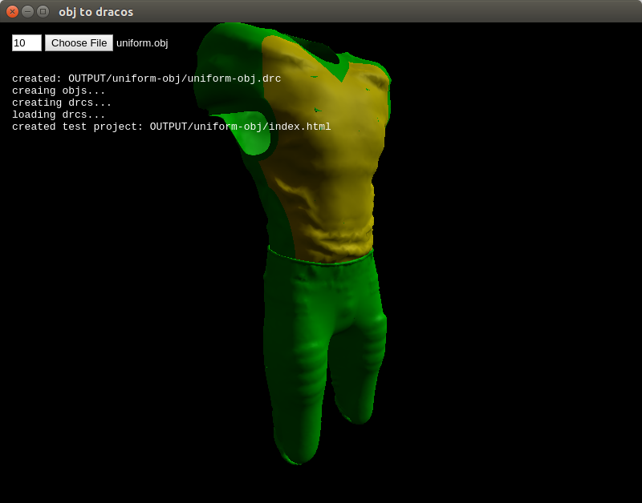

# obj2drcs

We need to convert many obj files with sub-objects (children) to [Draco](https://github.com/google/draco) files. Unfortunately the current version of draco_encoder converts all sub-objects [into a single mesh](https://github.com/google/draco/issues/67). This electron (nodejs) app takes an obj file with sub-objects and creates a directory of individual drc files of those sub-objects to be used in a three.js project.


### setup

you'll need to clone both draco and this repo
```
git clone https://github.com/brangerbriz/obj2drcs
git clone https://github.com/google/draco
```
then create a build folder for draco in obj2drcs
```
mkdir obj2drcs/draco_build
```
navigate in there and build it (you'll need cmake)
```
cd obj2drcs/draco_build
cmake ../../draco
make
```

navigate back up to the root and download the node dependencies
```
cd ../
npm install
```

### using it

to launch the app run
```
npm start
```
you should see a black screen with a number field and a 'Choose File' button. The number field can be set from 1 to 10, this is the compression level to set the draco_encoder to. click the 'Choose File' to choose an obj file (assumes an obj file with sub-objects) and you should see some status print to the screen:



After that the mesh should appear in the window, use the mouse wheel to zoom in/out and the mouse to rotate and inspect the mesh. Make sure that hovering over the individual sub-objects changes their color.

If all is working well you can inspect the directory created for this mesh inside the `OUTPUT` directory. There you should find a `file-obj.drc` of the full mesh (this can be ignored) as well as folders with the individual sub-objects as `objs` and `drcs`. You'll also find a `js` folder and `index.html` page. This page uses the drcs objects to create a similar mouse controlled raycasting demo as in the app. Use this as a template for how to use the generated drcs in a three.js project.

### debugging

if somethings not working, you can launch the app with the dev console open to debug:
```
npm run dev
```
please submit any issues for errors that show up in the console.
